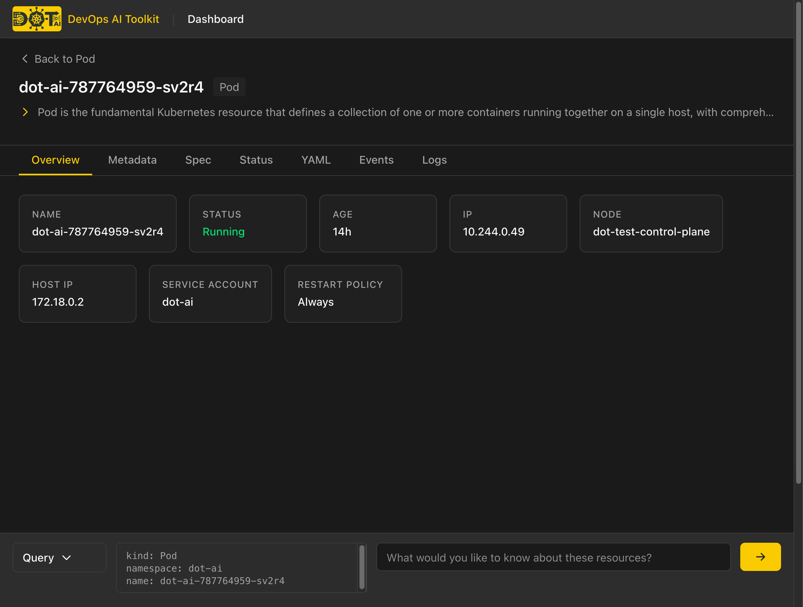
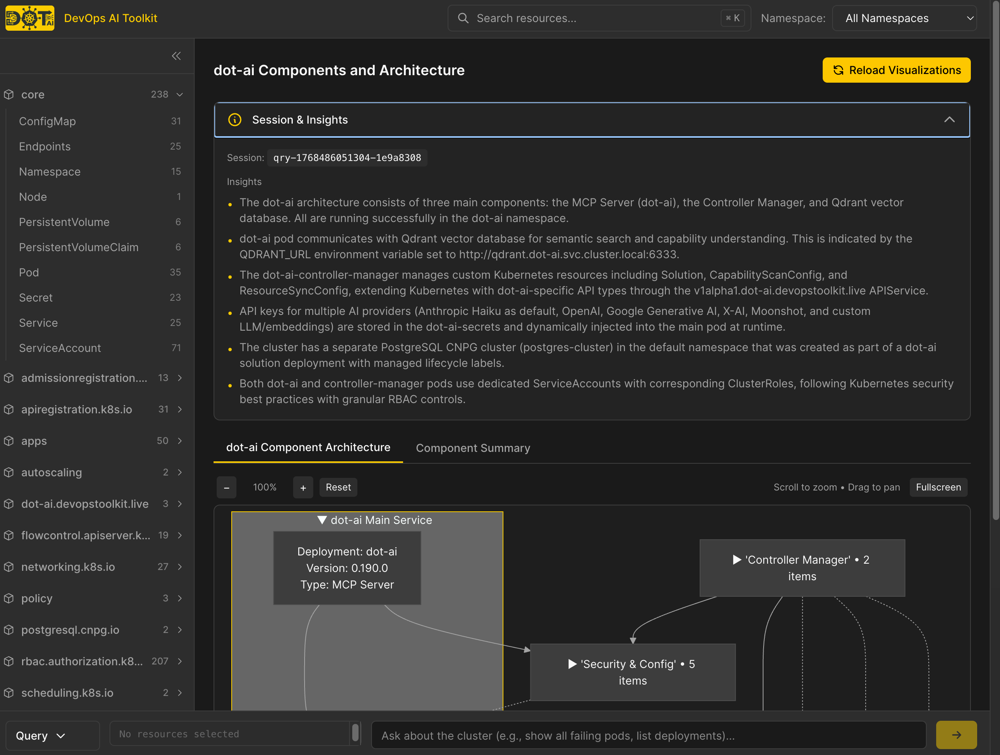
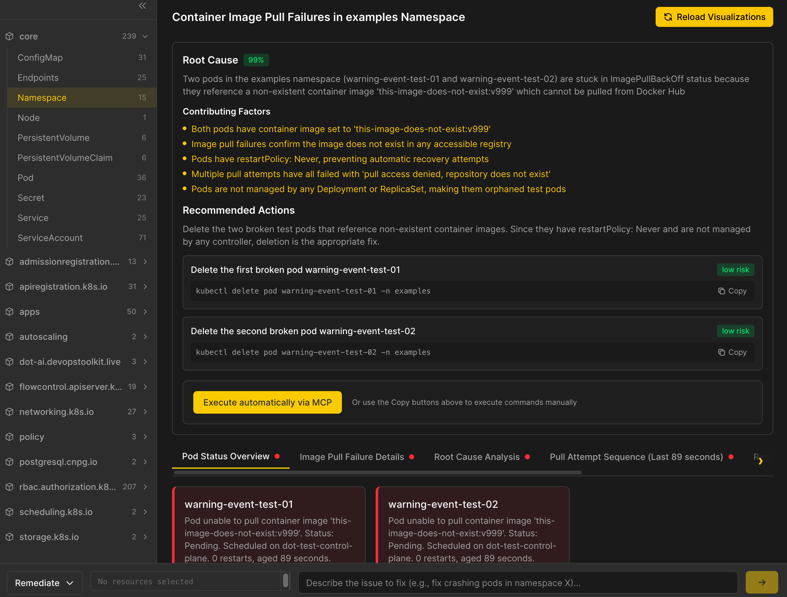
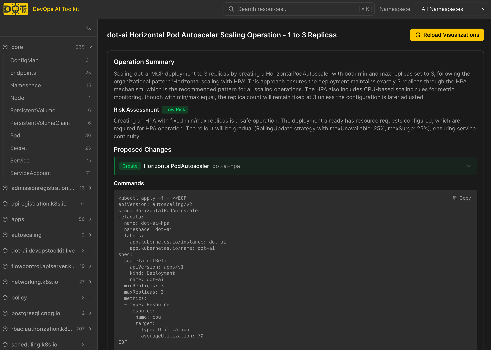
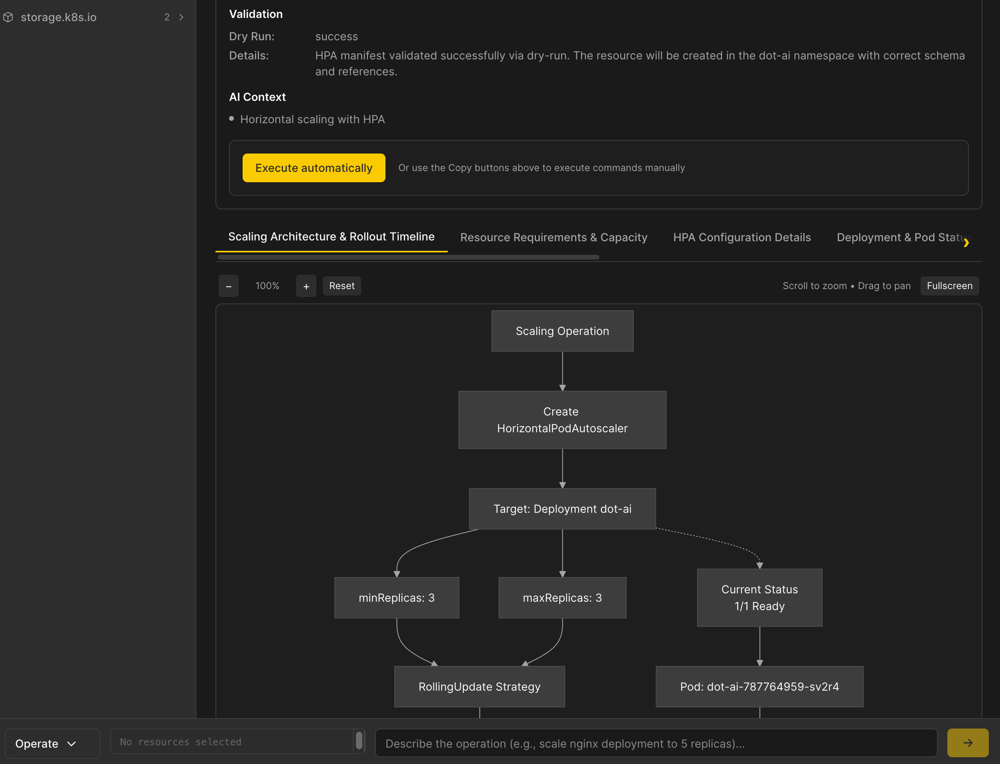
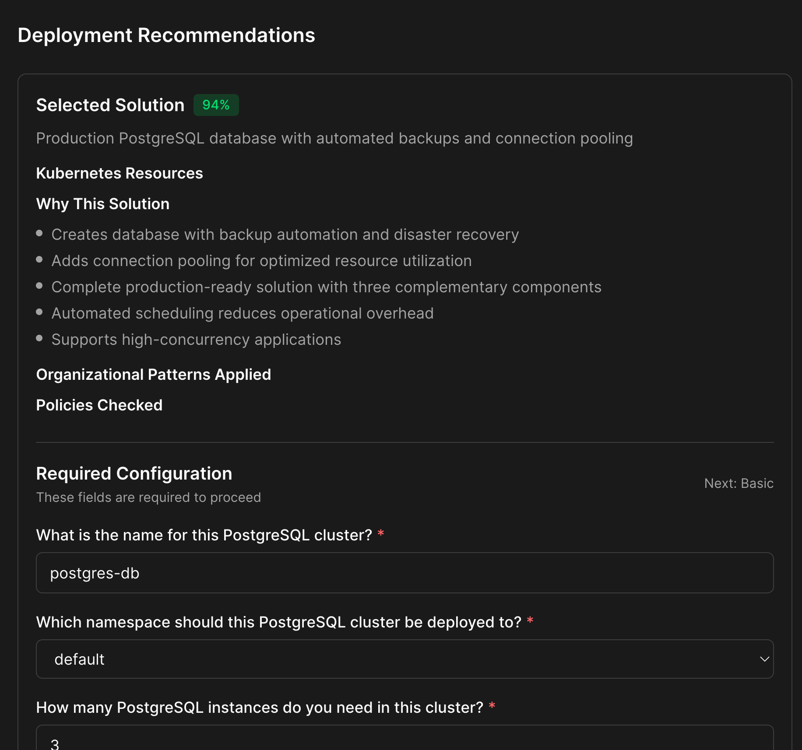

# DevOps AI Toolkit Web UI

**Kubernetes dashboard with AI-powered operations and rich visualizations for the DevOps AI Toolkit MCP server.**

---

## What is DevOps AI Toolkit Web UI?

DevOps AI Toolkit Web UI provides two main capabilities:

1. **Kubernetes Dashboard**: Browse and manage cluster resources with AI-powered operations (Query, Remediate, Operate, Recommend)
2. **Visualization Companion**: Render rich visualizations (diagrams, charts, tables) for MCP tool responses from your coding agent

## Kubernetes Dashboard

The dashboard provides a unified interface for Kubernetes resource management with integrated AI capabilities.


**Key features:**

- **Resource Browser**: Navigate resources by API group in the collapsible sidebar
- **Namespace Filtering**: Filter all views by namespace using the dropdown
- **Semantic Search**: Find resources using natural language queries (Cmd+K / Ctrl+K)
- **Relevance Scoring**: Search results ranked by semantic relevance with color-coded badges
- **AI Action Bar**: Query, Remediate, Operate, or Recommend actions available from any view

**Architecture**: The dashboard queries a Vector Database (Qdrant) instead of the Kubernetes API directly. This provides significantly faster response times on large clusters (thousands of resources) and enables semantic search across all resource types including CRDs. Live status data (pod phase, replica counts) is fetched from the Kubernetes API only for displayed resources.

### Resource Details

Click any resource to view its details with multiple tabs:



- **Overview**: Key information displayed as cards (status, age, IP, node, etc.)
- **Metadata**: Labels, annotations, owner references
- **Spec**: Resource specification (read-only)
- **Status**: Current status from Kubernetes API
- **YAML**: Full resource manifest with syntax highlighting and copy button
- **Events**: Related Kubernetes events (lazy-loaded)
- **Logs**: Container logs with tail/refresh (Pods only)

### AI-Powered Operations

The Action Bar at the bottom of every page provides access to four AI tools. Select resources from the dashboard, type your intent, and let AI analyze or operate on your cluster.

#### Query

Ask natural language questions about your cluster. Results include tables, diagrams, and insights.



[Query tool documentation](https://devopstoolkit.ai/docs/mcp/guides/mcp-query-guide)

#### Remediate

Diagnose issues and get AI-generated fix suggestions. The workflow shows root cause analysis, contributing factors, and recommended actions with risk levels. You can execute fixes directly or copy commands for manual execution.



[Remediate tool documentation](https://devopstoolkit.ai/docs/mcp/guides/mcp-remediate-guide)

#### Operate

Perform Day 2 operations like scaling, updating, or rolling back. The AI shows proposed changes (creates, updates, deletes) with YAML previews and dry-run validation before execution.





[Operate tool documentation](https://devopstoolkit.ai/docs/mcp/guides/mcp-operate-guide)

#### Recommend

Get deployment recommendations for new workloads. A multi-step wizard guides you through solution selection, configuration questions, and manifest generation. Download manifests or deploy directly to the cluster.



[Recommend tool documentation](https://devopstoolkit.ai/docs/mcp/guides/mcp-recommendation-guide)

## Visualization Companion

When using an MCP client (VS Code, Claude Desktop, etc.), AI responses can include visualization URLs. Opening these URLs renders rich visual representations.

**How it works:**

```text
1. User in MCP client: "show me resources in production namespace"

2. MCP server responds with visualization URL:
   "Here are the resources in production:
   View visualization: https://ui.example.com/v/session-abc123"

3. User opens URL in browser to see diagrams, tables, and insights

4. User returns to MCP client to continue conversation
```

## Authentication

The dashboard requires authentication to protect access to cluster resources and AI operations. Bearer token authentication is used by default.

**How it works:**

1. On first visit, users see a login page prompting for an access token
2. The token is validated against the server
3. Once authenticated, the token is stored in browser sessionStorage (cleared when the tab closes)
4. All API requests include the token in the `Authorization: Bearer <token>` header

**Getting your token:**

- If `uiAuth.token` or `uiAuth.secretRef` is configured in Helm values, use that token
- If neither is set, a random token is auto-generated at startup - check the pod logs:
  ```bash
  kubectl logs -n dot-ai deployment/dot-ai-ui | grep "Auth token"
  ```

See [Kubernetes Setup](setup/kubernetes-setup.md) for configuration options.

## Quick Start

> **Recommended**: For the easiest setup, install the complete dot-ai stack which includes all components (MCP server, Web UI, and Controller). See the [Stack Installation Guide](https://devopstoolkit.ai/docs/stack).
>
> Continue below if you want to install this component individually (for non-Kubernetes setups or granular control).

### Prerequisites

- Kubernetes cluster with [dot-ai MCP server](https://devopstoolkit.ai/docs/mcp/setup/mcp-setup/) deployed
- Helm 3.x installed

### Deploy Web UI

```bash
# Set the version from https://github.com/vfarcic/dot-ai-ui/releases
export DOT_AI_UI_VERSION="..."

# Use the same auth token as your dot-ai MCP server
export DOT_AI_AUTH_TOKEN="your-dot-ai-auth-token"

# Token for UI login
export DOT_AI_UI_AUTH_TOKEN="your-ui-access-token"

helm install dot-ai-ui \
  oci://ghcr.io/vfarcic/dot-ai-ui/charts/dot-ai-ui:$DOT_AI_UI_VERSION \
  --set dotAi.url="http://dot-ai:3456" \
  --set dotAi.auth.token="$DOT_AI_AUTH_TOKEN" \
  --set uiAuth.token="$DOT_AI_UI_AUTH_TOKEN" \
  --set ingress.enabled=true \
  --set ingress.host="dot-ai-ui.127.0.0.1.nip.io" \
  --namespace dot-ai \
  --wait
```

### Configure dot-ai MCP Server

Update your dot-ai MCP server to include visualization URLs in responses:

```bash
helm upgrade dot-ai-mcp oci://ghcr.io/vfarcic/dot-ai/charts/dot-ai:$DOT_AI_VERSION \
  --set webUi.baseUrl="http://dot-ai-ui.127.0.0.1.nip.io" \
  --namespace dot-ai \
  --reuse-values
```

[Full Kubernetes Setup Guide](setup/kubernetes-setup.md)

## Documentation

- **[Kubernetes Setup](setup/kubernetes-setup.md)** - Complete Helm installation guide with TLS and Gateway API options

## Support

- **GitHub Issues**: [Bug reports and feature requests](https://github.com/vfarcic/dot-ai-ui/issues)

## Related Projects

- **[dot-ai](https://github.com/vfarcic/dot-ai)** - DevOps AI Toolkit MCP server
- **[dot-ai-controller](https://github.com/vfarcic/dot-ai-controller)** - Kubernetes controller for autonomous operations

---

**DevOps AI Toolkit Web UI** - Rich visualizations for AI-powered DevOps workflows.
