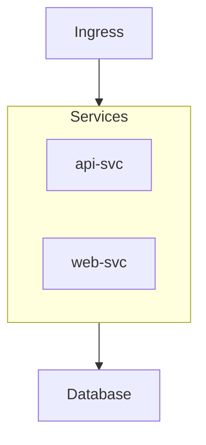
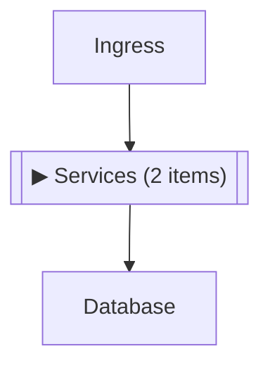

# PRD #5: Collapsible Subgraphs in Mermaid Flowcharts

**GitHub Issue**: [#5](https://github.com/vfarcic/dot-ai-ui/issues/5)
**Created**: 2026-01-01
**Status**: Draft
**Priority**: Medium

---

## Problem Statement

Mermaid flowchart diagrams can become complex and overwhelming, especially when visualizing Kubernetes architectures, deployment pipelines, or system dependencies. The Mermaid library doesn't natively support collapsing/expanding nodes ([approved but not implemented](https://github.com/mermaid-js/mermaid/issues/5508)).

Users cannot interactively explore diagrams by expanding/collapsing sections to focus on specific areas of interest.

## Solution Overview

Implement a client-side re-render approach for Mermaid flowchart diagrams that:

1. Parses subgraphs from Mermaid source code
2. Renders diagrams with subgraphs collapsed by default
3. Allows clicking to expand/collapse subgraphs
4. Re-renders the diagram with modified Mermaid code reflecting the collapsed state

This is purely a UI enhancement - no MCP server changes required. The MCP server continues to return standard Mermaid syntax with subgraphs, and the UI handles interactivity.

## User Experience

### Default State
- Flowcharts with subgraphs render with subgraphs **collapsed by default**
- Collapsed subgraphs appear as placeholder nodes showing: `▶ [Subgraph Label] (N items)`
- Diagrams without subgraphs (or non-flowchart types) render normally without any changes

### Interaction
- Click a collapsed subgraph placeholder to **expand** it (shows all child nodes)
- Click an expanded subgraph header to **collapse** it back
- Visual indicator (▶/▼) shows expand/collapse state
- Zoom, pan, and fullscreen continue to work as before

### Example

**Original Mermaid (from MCP):**


**Rendered collapsed (default):**


**After clicking to expand:**
Original diagram with full subgraph visible, header shows `▼ Services`

## Technical Approach

### 1. Subgraph Parser
Parse Mermaid flowchart source to extract:
- Subgraph IDs and labels
- Nodes contained within each subgraph
- Edges connected to/from subgraphs

```typescript
interface ParsedSubgraph {
  id: string
  label: string
  content: string  // Raw content inside subgraph
  nodeIds: string[]  // Nodes contained within
}
```

### 2. State Management
Track collapsed state for each subgraph:

```typescript
const [collapsedSubgraphs, setCollapsedSubgraphs] = useState<Set<string>>(
  new Set(/* all subgraph IDs - collapsed by default */)
)
```

### 3. Mermaid Code Generation
Generate modified Mermaid code based on collapsed state:
- Replace collapsed subgraph with placeholder node
- Preserve edges to/from the subgraph
- Keep expanded subgraphs as-is

### 4. Re-render Integration
Use Mermaid's `render()` + `bindFunctions()` pattern:

```typescript
const { svg, bindFunctions } = await mermaid.render(id, modifiedCode)
element.innerHTML = svg
bindFunctions?.(element)
```

### 5. Click Handling
- Use Mermaid's `click nodeId callback` syntax for placeholder nodes
- Or add click handlers directly to SVG elements post-render

## Scope

### In Scope
- Flowchart diagrams (`graph` and `flowchart` types)
- Single-level subgraph collapse/expand
- Nested subgraphs (collapsed parent hides all nested content)
- Visual indicators for collapse state
- Preserve existing zoom/pan/fullscreen functionality

### Out of Scope
- Non-flowchart diagram types (sequence, state, ER, etc.)
- Collapsing individual nodes (only subgraphs)
- Persisting collapse state across sessions
- MCP server modifications

## Success Criteria

1. Flowcharts with subgraphs render with subgraphs collapsed by default
2. Clicking expands/collapses subgraphs smoothly
3. Edge connections are preserved correctly when collapsed
4. Non-flowchart diagrams continue to work unchanged
5. No regression in existing zoom/pan/fullscreen functionality
6. Performance remains acceptable for diagrams with multiple subgraphs

## Risks & Mitigations

| Risk | Likelihood | Impact | Mitigation |
|------|------------|--------|------------|
| Complex Mermaid syntax edge cases | Medium | Medium | Start with common patterns, add edge case handling iteratively |
| Performance with many subgraphs | Low | Medium | Re-render is fast; optimize if needed |
| Mermaid parser changes in future versions | Low | High | Pin Mermaid version; add integration tests |

## Dependencies

- Mermaid.js (existing dependency)
- No new dependencies required

---

## Milestones

- [ ] **M1: Subgraph Parser** - Parse flowchart Mermaid code to extract subgraph structure (IDs, labels, contained nodes, edges)
- [ ] **M2: Collapsed Code Generator** - Generate modified Mermaid code with collapsed subgraphs replaced by placeholder nodes
- [ ] **M3: State Management & Re-render** - Implement collapse state tracking and re-render flow with `bindFunctions()`
- [ ] **M4: Click Interaction** - Add click handlers to expand/collapse subgraphs with visual indicators (▶/▼)
- [ ] **M5: Edge Case Handling** - Handle nested subgraphs, edges to/from subgraphs, and various flowchart syntax patterns
- [ ] **M6: Testing & Polish** - Test with real MCP outputs, ensure no regression in existing functionality

---

## Progress Log

| Date | Milestone | Notes |
|------|-----------|-------|
| 2026-01-01 | PRD Created | Initial PRD based on research into Mermaid interactivity options |

---

## References

- [Mermaid Issue #5508 - Collapsible Subgraphs](https://github.com/mermaid-js/mermaid/issues/5508) (approved, not implemented)
- [Mermaid Issue #1123 - Fold out/collapse flowchart](https://github.com/mermaid-js/mermaid/issues/1123)
- [Mermaid Flowchart Syntax](https://mermaid.js.org/syntax/flowchart.html)
- [Mermaid Usage - bindFunctions](https://mermaid.js.org/config/usage.html)
